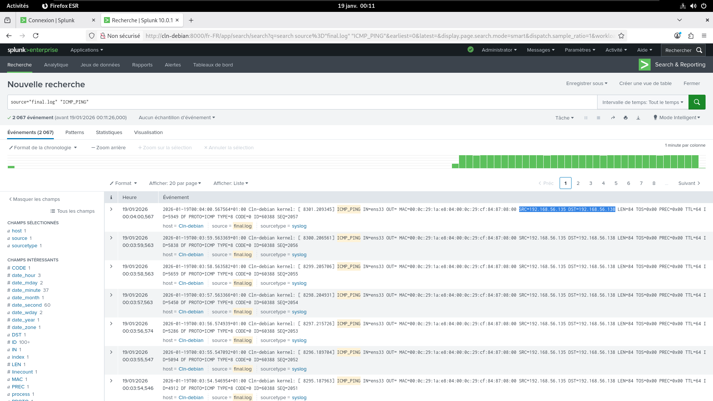
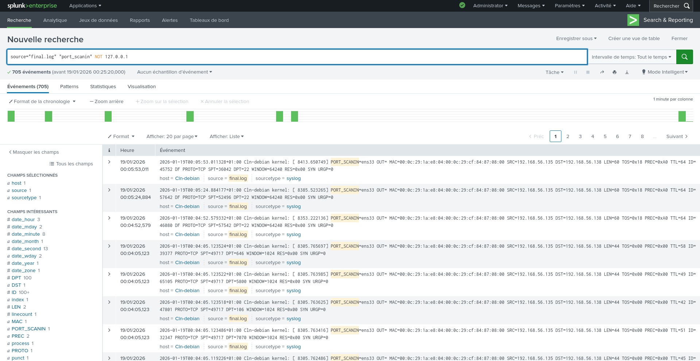
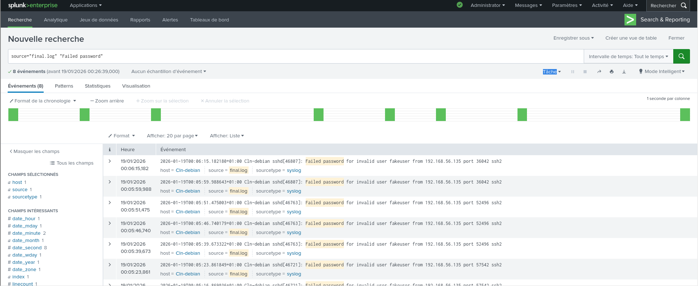

# 🛡️ Splunk Attack Detection Lab: Red vs. Blue Team

## 📖 Project Overview
This project demonstrates a functional **Red vs. Blue Team environment** where I simulated common cyber attacks (Ping Sweeps, Port Scanning, SSH Brute Force) and engineered a **Splunk SIEM** solution to detect them in real-time.

During the deployment, I also successfully diagnosed and resolved a critical infrastructure failure (Storage Saturation) on the live Linux server, performing partition resizing and swap file recreation via CLI to restore service availability.

## 🏗️ Architecture
* **Attacker (Red Team):** Kali Linux (IP: `192.168.56.135`)
    * Tools: `nmap`, `ping`, bash scripting for brute force.
* **Victim/Defender (Blue Team):** Debian Server (IP: `192.168.56.138`)
    * **SIEM:** Splunk Enterprise
    * **Firewall:** Custom `iptables` logging rules
    * **Logging:** `rsyslog`, `auth.log`

---

## 🔍 Attack Detection & Analysis

### 1. Network Reconnaissance (Ping Sweep)
**Scenario:** The attacker attempts to discover live hosts on the subnet.
**Defense:** configured `iptables` to log ICMP packets, which were forwarded to Splunk.

*Evidence shows repeated ICMP requests from the Kali IP.*

### 2. Port Scanning (Nmap)
**Scenario:** A comprehensive scan of the top 100 ports to identify vulnerabilities.
**Defense:** Detection of rapid TCP SYN packets targeting multiple destination ports.

*Evidence shows a massive volume of connection attempts on ports 22, 80, 3306, etc.*

### 3. Identity Attack (SSH Brute Force)
**Scenario:** Repeated attempts to guess the SSH password for user `fakeuser`.
**Defense:** Monitoring `/var/log/auth.log` for failed authentication events.

*Splunk successfully indexed "Failed password" events, attributing the attack to the Kali IP.*

---

## 🛠️ Technical Challenges Overcome
**Incident:** During the lab, the Splunk server crashed due to a "Disk Full" error on the Debian VM.
**Resolution:**
1.  Booted into recovery mode.
2.  Utilized `fdisk` and `growpart` to delete the swap partition and extend the root filesystem from 20GB to 43GB.
3.  Recreated a 2GB Swap file using `fallocate` and `mkswap` to stabilize memory usage.
4.  Restored Splunk services without data loss.

## 🚀 Technologies Used
* **SIEM:** Splunk Enterprise
* **OS:** Kali Linux, Debian 12
* **Networking:** Iptables, SSH, TCP/IP
* **Tools:** Nmap, Grep, Systemctl
